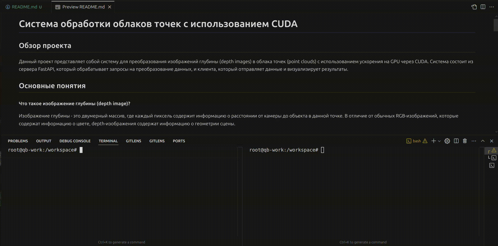

# Система обработки облаков точек с использованием CUDA

## Обзор проекта

Данный проект представляет собой систему для преобразования изображений глубины (depth images) в облака точек (point clouds) с использованием ускорения на GPU через CUDA. Система состоит из сервера FastAPI, который обрабатывает запросы на преобразование данных, и клиента, который отправляет данные и визуализирует результаты.




## Основные понятия

#### Что такое изображение глубины (depth image)?
Изображение глубины - это двумерный массив, где каждый пиксель содержит информацию о расстоянии от камеры до объекта в данной точке. В отличие от обычных RGB-изображений, которые содержат информацию о цвете, depth-изображения содержат информацию о геометрии сцены.

#### Что такое внутренние и внешние параметры камеры (intrinsics и extrinsics)?
- **Intrinsics** - внутренние параметры камеры, описывающие оптическую систему (фокусное расстояние, центр изображения и т.д.). Они позволяют преобразовать координаты из пространства изображения в координаты камеры.
- **Extrinsics** - внешние параметры камеры, описывающие положение и ориентацию камеры в мировой системе координат (матрица поворота и вектор перемещения).

#### Что такое облако точек (point cloud)?
Облако точек - это набор точек в трёхмерном пространстве, которые представляют поверхность объектов. Каждая точка имеет координаты X, Y, Z, а иногда и дополнительные атрибуты, такие как цвет.

## Установка и требования

### Требования
- CUDA Toolkit (версия 11.0+)
- Python 3.7+
- Библиотеки: FastAPI, uvicorn, numpy, open3d, requests, matplotlib

### Установка
1. Клонировать репозиторий:
```bash
git clone https://github.com/yourusername/pointcloud-processing.git
cd pointcloud-processing
```

2. Установить зависимости Python:
```bash
pip install fastapi uvicorn numpy open3d requests matplotlib
```

3. Скомпилировать CUDA-библиотеку:
```bash
mkdir -p build
nvcc -o build/libpointcloud.so --shared -Xcompiler -fPIC src/pointcloud.cu
```

## Использование

### Запуск сервера

Сервер обрабатывает запросы на преобразование изображений глубины в облака точек:

```bash
python src/server.py
```

По умолчанию сервер запускается на `http://localhost:8000`.

### Использование клиента

Клиент отправляет данные камеры на сервер и визуализирует полученное облако точек:

```bash
python src/client.py
```

Клиент загружает данные из директории `assets/captured_images` и отправляет их на сервер.

### Структура данных камеры

Для каждой камеры необходимы следующие файлы:
- `{camera_name}_rgb.png` - RGB-изображение (опционально)
- `{camera_name}_depth.npy` - Изображение глубины в формате numpy
- `{camera_name}_intrinsics.json` - Внутренние параметры камеры
- `{camera_name}_extrinsics.json` - Внешние параметры камеры

## API сервера

### Endpoint: `/process_point_cloud`
Принимает данные камеры и возвращает облако точек.

**Пример запроса:**
```python
import requests

request_data = {
    "name": "camera1",
    "depth": depth_array.tolist(),  # 2D массив глубины
    "rgb": rgb_array.tolist(),      # 3D массив RGB (опционально)
    "intrinsics": {
        "K": [fx, 0, cx, 0, fy, cy, 0, 0, 1]  # Матрица камеры
    },
    "extrinsics_json": {
        "translation": {"x": tx, "y": ty, "z": tz},
        "rotation": {"x": qx, "y": qy, "z": qz, "w": qw}
    }
}

response = requests.post("http://localhost:8000/process_point_cloud", json=request_data)
result = response.json()
```

## Реализация CUDA-ядра

### Псевдокод ядра

Ядро CUDA `depthToWorldPCDKernel` преобразует изображение глубины в облако точек, применяя следующие шаги для каждого пикселя:

```
function depthToWorldPCDKernel(depth, outPCD, fx, fy, cx, cy, extrinsics, width, height):
    // Загружаем матрицу extrinsics в shared память для быстрого доступа
    sharedExtrinsics = загрузить extrinsics в shared память
    
    // Вычисляем ID потока и количество пикселей на поток
    tid = blockIdx.x * blockDim.x + threadIdx.x
    totalPixels = width * height
    pixelsPerThread = (totalPixels + blockDim.x * gridDim.x - 1) / (blockDim.x * gridDim.x)
    
    // Обрабатываем несколько пикселей в одном потоке
    for p = 0 to pixelsPerThread-1:
        idx = tid * pixelsPerThread + p
        
        if idx >= totalPixels:
            continue
            
        u = idx % width
        v = idx / width
        
        d = depth[idx]
        
        // Преобразуем в координаты камеры
        Xc = (u - cx) * d / fx
        Yc = (v - cy) * d / fy
        Zc = d
        
        // Применяем внешние параметры для преобразования в мировые координаты
        Xw = sharedExtrinsics[0] * Xc + sharedExtrinsics[1] * Yc + sharedExtrinsics[2] * Zc + sharedExtrinsics[3]
        Yw = sharedExtrinsics[4] * Xc + sharedExtrinsics[5] * Yc + sharedExtrinsics[6] * Zc + sharedExtrinsics[7]
        Zw = sharedExtrinsics[8] * Xc + sharedExtrinsics[9] * Yc + sharedExtrinsics[10] * Zc + sharedExtrinsics[11]
        W = sharedExtrinsics[12] * Xc + sharedExtrinsics[13] * Yc + sharedExtrinsics[14] * Zc + sharedExtrinsics[15]
        
        // Нормализуем по W
        if W != 0:
            Xw /= W
            Yw /= W
            Zw /= W
        
        // Записываем в выходной массив
        outPCD[idx * 3 + 0] = Xw
        outPCD[idx * 3 + 1] = Yw
        outPCD[idx * 3 + 2] = Zw
```

### Оптимизации

- **Использование shared memory**: Матрица extrinsics кэшируется в shared memory для ускорения доступа.
- **Обработка нескольких пикселей на поток**: Каждый CUDA-поток обрабатывает несколько пикселей, что уменьшает количество запускаемых потоков.
- **Асинхронные операции**: Копирование данных и запуск ядра выполняются асинхронно с использованием CUDA-потоков.

## Производительность

- **NVIDIA GeForce RTX 3080**: Время выполнения ядра - 4.657 мс

Такая высокая производительность позволяет использовать систему в приложениях реального времени, включая роботизированное зрение, дополненную реальность и системы автономной навигации.
